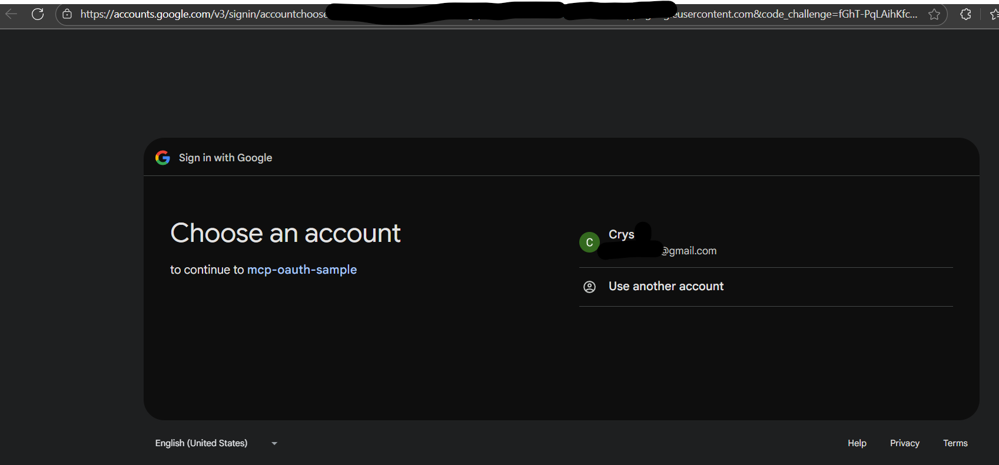
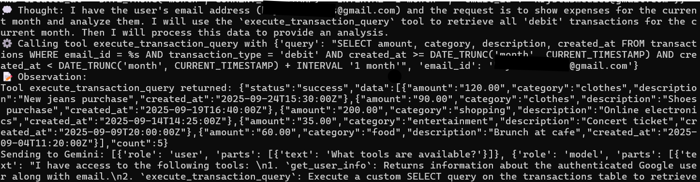
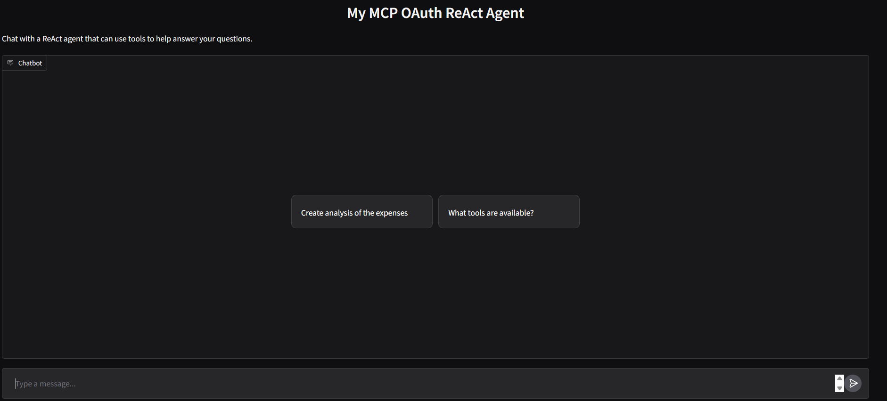
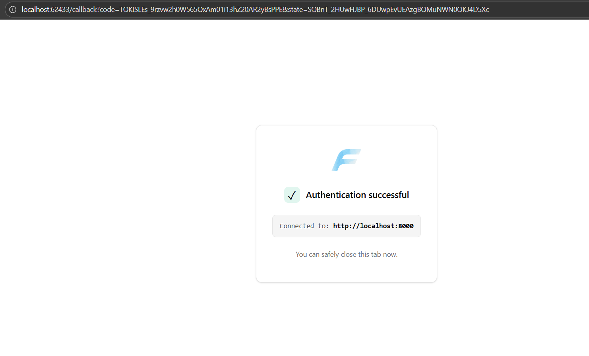
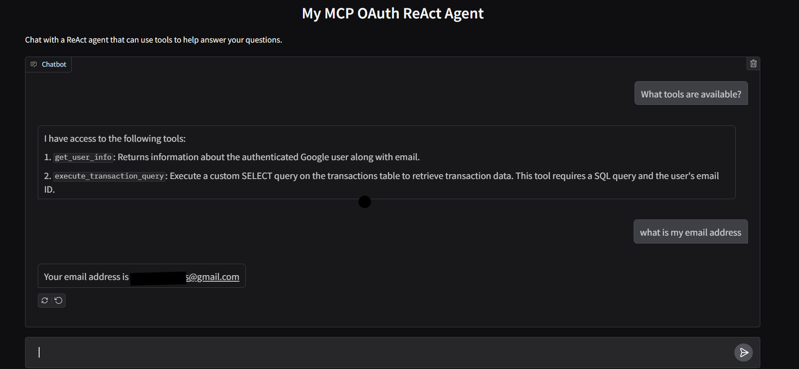
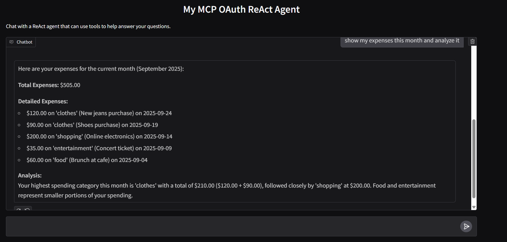

# MCP OAuth Sample with Expense Analysis

This project demonstrates a secure expense analysis application using Google OAuth authentication, FastMCP for tool management, and Gradio for the user interface. It connects to a Supabase database for storing and querying transaction data.

## Features

- 🔐 Google OAuth Authentication
- 💬 Interactive Chat Interface using Gradio
- 🤖 ReAct Agent powered by Google's Gemini AI
- 📊 Transaction Analysis Tools
- 🔒 Secure Database Queries
- 🗄️ Supabase Integration

## Prerequisites

- Python 3.8+
- A Google Cloud Project with OAuth 2.0 configured
- A Supabase project with the transactions table set up

### Database Schema

The application expects a `transactions` table in Supabase with the following schema:

```sql
CREATE TABLE transactions (
    email_id VARCHAR(255) NOT NULL,          -- identifies the person
    amount NUMERIC(12,2) NOT NULL,           -- transaction amount with 2 decimal places
    currency VARCHAR(10) NOT NULL DEFAULT 'USD', -- ISO 4217 currency code
    transaction_type VARCHAR(50) NOT NULL,   -- e.g., 'debit', 'credit', 'refund'
    category VARCHAR(50) NOT NULL,           -- e.g., 'food', 'clothes', 'shopping', 'other'
    description TEXT,                        -- optional description
    created_at TIMESTAMP WITH TIME ZONE DEFAULT CURRENT_TIMESTAMP
);
```

## Setup

1. Install dependencies:
   ```bash
   pip install -r requirements.txt
   ```

2. Set up environment variables in `.env`:
   ```env
   # Google OAuth Configuration
   CLIENT_ID=your_google_oauth_client_id
   CLIENT_SECRET=your_google_oauth_client_secret
   GOOGLE_API_KEY=your_gemini_api_key

   # Supabase Configuration
   SUPABASE_URL=your_supabase_project_url
   SUPABASE_KEY=your_supabase_anon_key
   SUPABASE_DATABASE_URL=your_supabase_direct_connection_string
   ```

## Running the Application

1. Start the MCP server:
   ```bash
   fastmcp run server.py --transport http --port 8000
   ```

2. In a separate terminal, start the chat interface:
   ```bash
   python react_agent.py
   ```

The chat interface will be available at `http://localhost:7860`.

## Available Tools

### 1. User Information
- `get_user_info()`: Retrieves authenticated user's email and name

### 2. Transaction Analysis
- `execute_transaction_query(query: str, email_id: str)`: Executes custom SELECT queries on the transactions table
  - Supports aggregations, filtering, and complex analysis
  - Requires `WHERE email_id = %s` clause for security
  - Example queries:
    ```sql
    SELECT amount, category FROM transactions WHERE email_id = %s AND created_at < '2026-01-01'
    SELECT SUM(amount) FROM transactions WHERE email_id = %s AND transaction_type = 'debit'
    ```

## Chat Interface Usage

The chat interface provides an interactive way to analyze expenses. Example queries:
- "Create analysis of the expenses"
- "What tools are available?"
- "Can you help me analyze some data?"

The ReAct agent will:
1. Understand your request
2. Use appropriate tools to gather data
3. Process and analyze the information
4. Provide a human-friendly response

## Security Features

- OAuth 2.0 authentication with Google
- Secure database queries with parameterized statements
- Email-based data isolation
- Read-only transaction analysis
- Required email verification

## Screenshots








## Architecture

- `server.py`: MCP server with tool definitions and OAuth setup
- `react_agent.py`: Chat interface and ReAct agent implementation
- Gradio for web interface
- Gemini AI for natural language understanding
- Supabase for secure data storage

## Contributing

1. Fork the repository
2. Create your feature branch
3. Commit your changes
4. Push to the branch
5. Create a new Pull Request